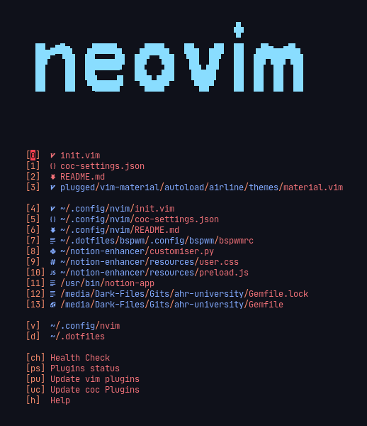
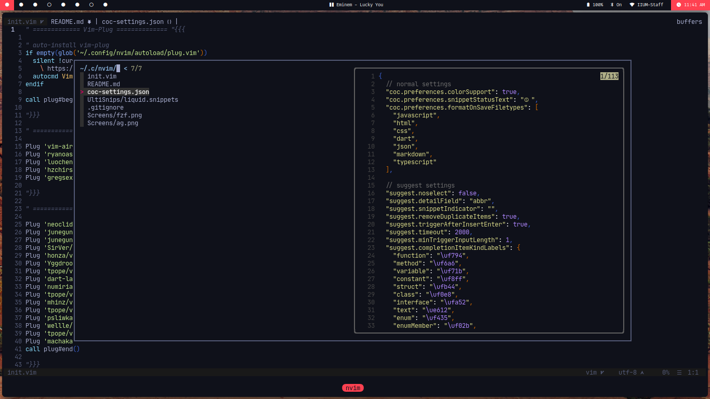
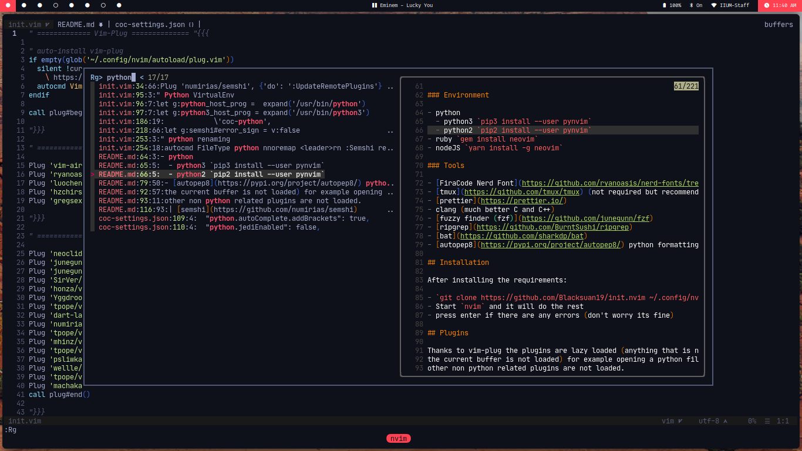

## Table of Contents

- [Why?](#why)
- [Features](#features)
  - [Supported Languages](#supported-languages)
- [Requirements](#requirements)
- [Setup](#setup)
  - [Environment](#Environment)
  - [Tools](#tools)
- [Installation](#installation)
- [Plugins](#plugins)
- [Keyboard shortcuts](#keyboard-shortcuts)
  - [FZF](#fzf-keyboard-shortcuts)
- [Custom Commands](#Custom-commands)
- [Customizations](#customizations)
- [Demos](#demos)
- [Credits](#credits)

## Why?

Modern Vim distributions are really huge and bloated with way too many fancy features
that you won't ever use or need, for example directory trees like Nerd tree, you
don't need a tree, you can view a project structure with fzf which is faster and has search.
Another example is [ThinkVim](https://github.com/hardcoreplayers/ThinkVim) has a
separate extension for formatting while also having ALE which can do that as
well, this double functionality is very common, thats one of the things this
distro avoids, KISS!

## Features

- Single file (you don't want your dotfiles to be all Vim script)
- Super minimal (~400 lines)
- Super fast startup (less than 40ms!)
- Lazy loading plugins
- Highly customizable
- Beautiful Material ocean color scheme
- Vscode like auto completion, multi cursor
- Smooth Scrolling (its really smooth!)
- floating window + borders + file previews on fzf(see [demos](#demos))
- Simple, Intuitive shortcuts

### Supported Languages

Neovim provides support for a wide range of languages by default.
There is also support for:

- [liquid](https://shopify.github.io/liquid/)

## Requirements

- Linux (not tested on other platforms)
- Neovim (you can try regular Vim)
- Properly set up environment

## Setup

To check if your current environment is correctly set up run `:CheckHealth`.

### Environment

- python
  - python3 `pip3 install --user pynvim`
  - python2 `pip2 install --user pynvim`
- ruby `gem install neovim`
- nodeJS `yarn install -g neovim`

### Tools

- [FiraCode Nerd Font](https://github.com/ryanoasis/nerd-fonts/tree/master/patched-fonts/FiraCode) (not required but Recommended)
- [tmux](https://github.com/tmux/tmux) (not required but recommended)
- [prettier](https://prettier.io/)
- clang (much better C and C++)
- [fuzzy finder (fzf)](https://github.com/junegunn/fzf)
- [ripgrep](https://github.com/BurntSushi/ripgrep)
- [bat](https://github.com/sharkdp/bat)
- [autopep8](https://pypi.org/project/autopep8/) python formatting

## Installation

After installing the requirements:

- `git clone https://github.com/Blacksuan19/init.nvim ~/.config/nvim`
- Start `nvim` and it will do the rest
- press enter if there are any errors (don't worry its fine)

## Plugins

Thanks to vim-plug the plugins are lazy loaded (anything that is not needed for
the current buffer is not loaded) for example opening a python file means all
other non python related plugins are not loaded.
Coc extensions are lazy loaded as well, they work the same way as vim-plug plugins.

| Plugin                                                       | Functionality                  |
| ------------------------------------------------------------ | ------------------------------ |
| [vim-airline](https://github.com/vim-airline/vim-airline)    | airline status line            |
| [devicons](https://github.com/ryanoasis/vim-devicons)        | icons everywhere               |
| [rainbow](https://github.com/luochen1990/rainbow)            | rainbow parenthesis            |
| [vim-material](https://github.com/hzchirs/vim-material)      | material themes                |
| [coc.nvim](https://github.com/neoclide/coc.nvim)             | async completion and more      |
| [fzf.vim](https://github.com/junegunn/fzf.vim)               | fuzzy finder vim integration   |
| [ultisnips](https://github.com/SirVer/ultisnips)             | snippets engine                |
| [vim-snippets](https://github.com/honza/vim-snippets)        | snippets for many languages    |
| [indentLine](https://github.com/Yggdroot/indentLine)         | auto indent lines              |
| [vim-liquid](https://github.com/tpope/vim-liquid)            | liquid language support        |
| [vim-commentary](https://github.com/tpope/vim-commentary)    | better comments everywhere     |
| [vim-startify](https://github.com/mhinz/vim-startify)        | cool startup thingy            |
| [vim-fugitive](https://github.com/tpope/vim-fugitive)        | best git integration around    |
| [vim-sandwich](https://github.com/machakann/vim-sandwich)    | surround stuff with stuff      |
| [vim-smoothie](https://github.com/psliwka/vim-smoothie)      | super smooth scrolling         |
| [tmux-complete](https://github.com/wellle/tmux-complete.vim) | tmux panes completion          |
| [vim-eunuch](https://github.com/tpope/vim-eunuch)            | some common Linux commands     |
| [semshi](https://github.com/numirias/semshi)                 | better highlighting for python |

## Keyboard shortcuts

To learn the default Vim shortcuts run `Tutor` and or checkout this [site](https://vim-adventures.com/).
Not a lot of changes have been done here, the plugins shortcuts are almost
identical, check each plugin under the [plugins](#plugins) section for its key
mappings, the changes i have made either make a function easier to access and or
expose a hidden functionality within a plugin.

#### Legend

`,` == leader key  
`S` == Shift key  
`C` == ctrl key  

| Mapping      | functionality                                        | Old Mapping |
| ------------ | ---------------------------------------------------- | ----------- |
| `;`          | commands key                                         | :           |
| `,r`         | reload Nvim config                                   | None        |
| `,q`         | close tab                                            | :q          |
| `,w`         | save changes                                         | :q          |
| `,f`         | fzf files viewer                                     | None        |
| `,e`         | call :PlugInstall (install plugins)                  | None        |
| `,t`         | search current file tags                             | None        |
| `,c`         | show list of editor commands in fzf                  | None        |
| `,d`         | show git diff in splits                              | None        |
| `,/`         | search in current folder                             | None        |
| `,rn`        | rename globally                                      | None        |
| `,a`         | run cocAction                                        | None        |
| `,s`         | format file with any available formatter             | None        |
| `,gc`        | git commits                                          | None        |
| `,sh`        | search search history using fzf                      | None        |
| `C-q`        | close all buffers and exit nvim                      | None        |
| `C-l`        | move to the split on the right                       | Default     |
| `C-k`        | move the split above                                 | Default     |
| `C-j`        | move to the split on below                           | Default     |
| `C-h`        | Move the split to the left                           | Default     |
| `C-c`        | highlights character for multi cursor selection      | None        |
| `C-a`        | Highlights word/selection for multi cursor selection | None        |
| `Tab`        | switch to the next buffer(normal mode)               | Default     |
| `S-Tab`      | switch to the previous buffer(tab)                   | Default     |
| `S-k`        | show current symbol documentation                    | None        |
| `F1`         | open Mappings for current mode                       | None        |
| `F5`         | Trim white spaces                                    | None        |
| `F6`         | Startify                                             | Default     |
| `]g`         | next diagnostic                                      | None        |
| `[g`         | Previous diagnostic                                  | None        |
| `gd`         | jump to definition(using coc)                        | None        |
| `gy`         | jump to type definition(using coc)                   | None        |
| `gi`         | jump to implementation(using coc)                    | None        |
| `gr`         | jump to references (using coc)                       | None        |
| `<esc><esc>` | disable search highlighting for current search       | None        |

### FZF keyboard shortcuts

| Mapping | Functionality                 |
| ------- | ----------------------------- |
| `C-x`   | Open file in horizontal split |
| `C-v`   | Open file in vertical split   |
| `C-t`   | Open file in new tab          |

## Custom commands

| Command | Functionality                            |
| ------- | ---------------------------------------- |
| Format  | format file with any available formatter |
| OR      | organize imports                         |
| Rg      | Advanced Grep                            |

## Customizations

Since the file is pretty small its very easy to interpret by even those who
don't have any knowledge about vim script, most of the sections have comments
about their functionality, and can be removed, commented out or swapped easily,
there are some defaults that are not everyone's cup of tea (after all this is
highly opinionated).

- **Disabling Plugins:** comment out the plug's 'Plugin/name' line from config and also remove the
  plugin settings

- **Disabling CoC Plugins:** comment out the plugin from `coc_global_extensions` variable and
  then uninstall it via `:CocUninstall` plugin name

- **Installing CoC plugins:** open `:CocList` and search for marketplace, you can find all
  available plugins here

- **Adding Bookmarks:** to add bookmarks to the start page, find `g:startify_bookmarks` in
  `init.nvim` and add the a new bookmark just like the already present ones, the dictionary
  key is the shortcut you will use to quickly jump to that folder from the start page and
  the value is the path to targeted folder

for more customizations read throw the config file, there are comments everywhere and its
easy to interpret, you can also checkout linked the github pages for each plugin for even
more options.

## Demos

### Project files with fzf

### Project wide search with fzf

### workflow demo

## Credits

All the Credit goes to the Neovim team for making most of the extensions
possible and better (async), and to all the plugins developers, and the hacker
who spend time Finding good shortcuts and tricks to make this an even more
superb experience.
