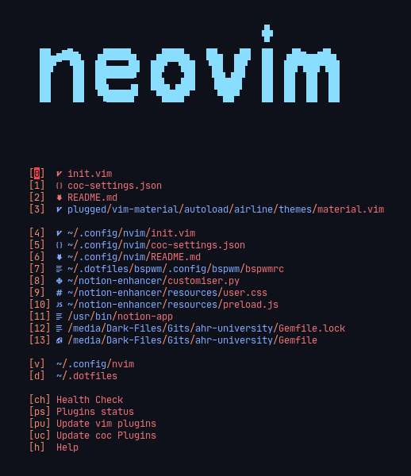
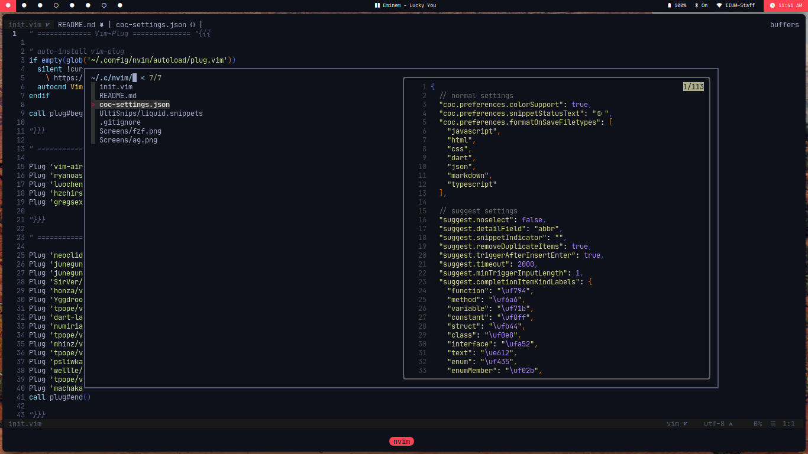
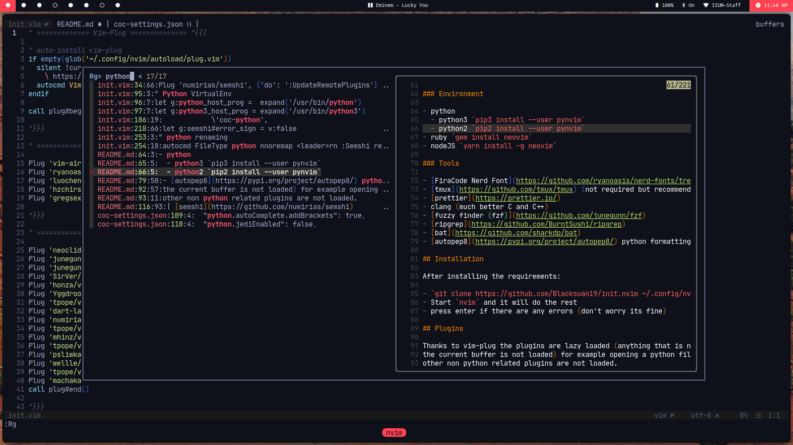
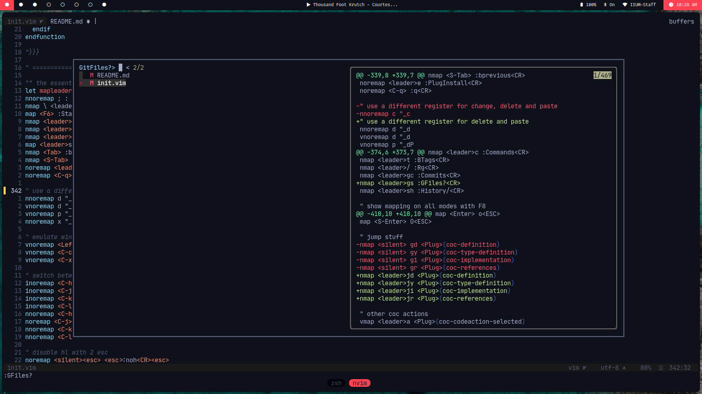

# init.nvim

## Why?

Modern Vim distributions are really huge and bloated with way too many fancy
features that you won't ever use or need, for example directory trees like Nerd
tree, you don't need a tree, you can view a project structure with fzf which is
faster and has search. Another example is
[ThinkVim](https://github.com/hardcoreplayers/ThinkVim) has a separate extension
for formatting while also having ALE which can do that as well, this double
functionality is very common, thats one of the things this distro avoids, KISS!

## Features

- Lua-first Neovim config
- Native LSP powered by Neovim, Mason, Conform, and Blink
- Lazy-managed plugins with modular config under `lua/config/` and
  `lua/plugins/`
- Ayu-based theme with automatic light/dark switching, custom floats, and a
  custom statusline
- Modern Snacks-based picker and scrolling workflow
- Noice-powered command line and notifications
- Simple, intuitive shortcuts

### Supported Languages

Built-in LSP and formatter setup is included for Bash, C/C++, CSS, HTML, JSON,
Lua, Python, TypeScript, XML, and YAML. Mason installs the configured language
servers and formatters automatically on startup.

## Requirements

- Linux (not tested on other platforms)
- Neovim `0.11+`
- Properly set up environment

## Setup

To check if your current environment is correctly set up run `:CheckHealth`.

### Environment

- python3: `pip3 install --user pynvim`
- javascript: `npm install -g neovim`

### Tools

- [Any patched nerd font](https://github.com/ryanoasis/nerd-fonts/)
- [tmux](https://github.com/tmux/tmux) (not required but recommended)
- [git](https://git-scm.com/)
- [ripgrep](https://github.com/BurntSushi/ripgrep)
- a C toolchain for `clangd` / `clang-format`

Most language servers and formatters are installed automatically through Mason.

## Installation

After installing the requirements:

- `git clone https://github.com/Blacksuan19/init.nvim ~/.config/nvim`
- Start `nvim` and it will do the rest
- press enter if there are any errors (don't worry its fine)

## Plugins

Plugins are managed by `lazy.nvim`, with language servers and formatters handled
by Mason.

| Plugin                                                                                        | Functionality                                |
| --------------------------------------------------------------------------------------------- | -------------------------------------------- |
| [lazy.nvim](https://github.com/folke/lazy.nvim)                                               | plugin management                            |
| [blink.cmp](https://github.com/Saghen/blink.cmp)                                              | completion UI                                |
| [conform.nvim](https://github.com/stevearc/conform.nvim)                                      | formatting                                   |
| [gitsigns.nvim](https://github.com/lewis6991/gitsigns.nvim)                                   | git signs in the gutter                      |
| [mason.nvim](https://github.com/williamboman/mason.nvim)                                      | external tool management                     |
| [mason-lspconfig.nvim](https://github.com/williamboman/mason-lspconfig.nvim)                  | LSP server installation bridge               |
| [mason-tool-installer.nvim](https://github.com/WhoIsSethDaniel/mason-tool-installer.nvim)     | auto-installs tools on startup               |
| [mini.nvim](https://github.com/nvim-mini/mini.nvim)                                           | icons, comments, move, surround              |
| [nvim-lspconfig](https://github.com/neovim/nvim-lspconfig)                                    | LSP server configs                           |
| [alpha-nvim](https://github.com/goolord/alpha-nvim)                                           | start screen                                 |
| [neovim-ayu](https://github.com/Shatur/neovim-ayu)                                            | colorscheme                                  |
| [noice.nvim](https://github.com/folke/noice.nvim)                                             | command line and message UI                  |
| [nvim-notify](https://github.com/rcarriga/nvim-notify)                                        | notifications                                |
| [rainbow-delimiters.nvim](https://github.com/HiPhish/rainbow-delimiters.nvim)                 | rainbow bracket highlighting                 |
| [friendly-snippets](https://github.com/rafamadriz/friendly-snippets)                          | VS Code-style snippet collection for Blink   |
| [blink-cmp-conventional-commits](https://github.com/disrupted/blink-cmp-conventional-commits) | conventional commit suggestions for Blink    |
| [blink-cmp-tmux](https://github.com/mgalliou/blink-cmp-tmux)                                  | tmux pane text as a Blink completion source  |
| [blink-cmp-words](https://github.com/archie-judd/blink-cmp-words)                             | English words and synonyms for Blink         |
| [snacks.nvim](https://github.com/folke/snacks.nvim)                                           | indent guides, picker, smooth scrolling      |
| [auto-dark-mode.nvim](https://github.com/f-person/auto-dark-mode.nvim)                        | automatic theme switching                    |
| [MatchTag](https://github.com/gregsexton/MatchTag)                                            | matching HTML/XML tags                       |
| [vim-fugitive](https://github.com/tpope/vim-fugitive)                                         | best git integration around                  |
| [tmux-navigator](https://github.com/christoomey/vim-tmux-navigator)                           | seamless movement between Vim and tmux panes |
| [vim-eunuch](https://github.com/tpope/vim-eunuch)                                             | some common Linux commands                   |

## Keyboard shortcuts

To learn the default Vim shortcuts run `Tutor` and or checkout this
[vim adventures](https://vim-adventures.com/).

### Essentials

| Mapping      | functionality                   |
| ------------ | ------------------------------- |
| `;`          | commands key                    |
| `,`          | leader key                      |
| `leader + w` | save changes                    |
| `leader + e` | sync plugins with Lazy          |
| `Enter`      | enter empty line in normal mode |
| `S-Enter`    | enter empty line above          |
| `F2`         | trim trailing whitespace        |
| `F6`         | open the start screen           |

### Visual Mode Essentials

| Mapping    | functionality                   |
| ---------- | ------------------------------- |
| `ctrl + j` | move selected text to bottom    |
| `ctrl + k` | move selected text to top       |
| `ctrl + h` | move selected text to the left  |
| `ctrl + l` | move selected text to the right |

### Navigation

`ctrl + hjkl` navigation also supports tmux panes.

| Mapping      | functionality                          |
| ------------ | -------------------------------------- |
| `leader + q` | confirm and delete current buffer      |
| `\`          | alias for `leader + q`                 |
| `ctrl + q`   | confirm and quit Neovim                |
| `ctrl + l`   | move to the split on the right         |
| `ctrl + k`   | move the split above                   |
| `ctrl + j`   | move to the split on below             |
| `ctrl + h`   | move the split to the left             |
| `Tab`        | switch to the next buffer(normal mode) |
| `S-Tab`      | switch to the previous buffer          |

### IDE Features

| Mapping       | functionality                        |
| ------------- | ------------------------------------ |
| `OR`          | organize imports                     |
| `leader + a`  | run code action                      |
| `leader + s`  | format file with available formatter |
| `leader + rn` | rename globally                      |
| `leader + jd` | jump to definition                   |
| `leader + jy` | jump to type definition              |
| `leader + ji` | jump to implementation               |
| `leader + jr` | jump to references                   |
| `K`           | show current symbol documentation    |
| `]g`          | next diagnostic                      |
| `[g`          | Previous diagnostic                  |

### Picker windows

| Mapping       | functionality                            |
| ------------- | ---------------------------------------- |
| `leader + f`  | files viewer                             |
| `leader + c`  | show editor commands                     |
| `leader + /`  | search in current folder files           |
| `leader + sh` | search / history                         |
| `leader + b`  | show open buffers                        |
| `leader + t`  | search current buffer lines              |
| `F1`          | show keyboard shortcuts for current mode |

### Git

| Mapping       | functionality     |
| ------------- | ----------------- |
| `leader + gd` | git diff split    |
| `leader + gc` | git commits       |
| `leader + gb` | git blame         |
| `leader + gs` | git status picker |

## Custom commands

| Command    | Functionality                            |
| ---------- | ---------------------------------------- |
| `Format`   | format file with any available formatter |
| `OR`       | organize imports                         |
| `Files`    | open the file picker                     |
| `Rg`       | grep project files                       |
| `Buffers`  | list open buffers                        |
| `Commands` | list editor commands                     |
| `BTags`    | search current buffer lines              |
| `Commits`  | show git commits                         |

## Customizations

This config is organized as a small Lua codebase rather than a single init file.
Core editor behavior lives under `lua/config/`, while plugin declarations and
plugin-specific setup live under `lua/plugins/`. That makes it easier to change
one part of the setup without digging through unrelated settings.

If you want to customize behavior, the most useful places to look are:

- `lua/config/options.lua` for editor options
- `lua/config/keymaps.lua` for global mappings
- `lua/config/autocmds.lua` for editor automation
- `lua/config/theme.lua` and `lua/config/statusline.lua` for appearance
- `lua/plugins/*.lua` for plugin choices and plugin-specific behavior

- **Disabling Plugins:** remove or edit the relevant spec under `lua/plugins/`
  and adjust any matching config under `lua/config/`

- **Managing LSP tools:** use `:Mason`, `:MasonToolsInstall`, and
  `:MasonToolsUpdate`

- **Formatting:** use `:Format` to format the current buffer with Conform

- **Adding Bookmarks:** to add bookmarks to the start page, find the Alpha start
  screen config in `lua/plugins/alpha.lua`

- **Reloading config:** a full Neovim restart is still the most reliable way to
  apply changes across this Lua config, especially plugin spec edits

For deeper customization, read through the relevant Lua module and then check
the upstream plugin documentation for any extra options you want to enable.

## Demos

### Project files with fuzzy finder

### Project wide search

### Git Status

### workflow demo

## Credits

All the Credit goes to the Neovim team for making most of the extensions
possible and better (async), and to all the plugins developers, and the hackers
who spend time Finding good shortcuts and tricks to make this an even more
superb experience.
